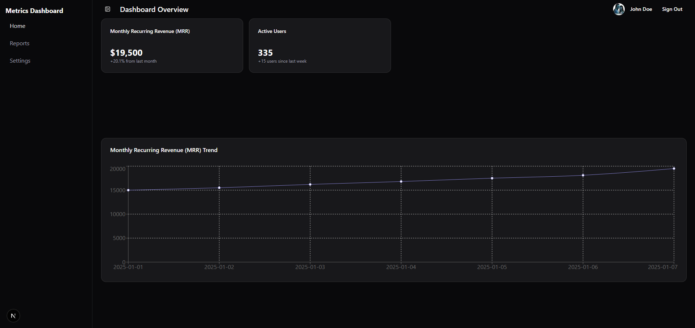

# SaaS Performance Dashboard

 <!-- เราจะสร้าง screenshot นี้ทีหลัง -->

> A production-grade frontend for a SaaS performance analytics dashboard. Built with Next.js, TypeScript, Tailwind CSS, and following modern development best practices including CI/CD, automated testing, and performance optimization.

## 🚀 Features

-   **Authentication:** Secure user login/logout functionality using NextAuth.js (Credentials Provider).
-   **Protected Routes:** Dashboard and its sub-pages are protected and accessible only to authenticated users.
-   **User Profile Management:** Users can view and update their profile information.
-   **Responsive Design:** Fully functional and aesthetic UI for both desktop and mobile devices.
-   **Interactive UI:** Smooth sidebar interactions with animations.
-   **Data Visualization:** Interactive charts to display key metrics (MRR, Active Users).
-   **Data Tables:** Sortable and paginated data tables for detailed reports.
-   **Form & Security:** Secure form handling with client-side validation and XSS protection awareness.
-   **Comprehensive Testing:** Includes Unit and Integration tests for core logic and UI interactions.
-   **Performance Optimized:** Blazing fast loading times thanks to Lazy Loading components and Next.js Image Optimization.
-   **Live Error Monitoring:** Integrated with Sentry for real-time error tracking in production.

## 🛠️ Tech Stack

-   **Framework:** [Next.js](https://nextjs.org/) (App Router)
-   **Language:** [TypeScript](https://www.typescriptlang.org/)
-   **Styling:** [Tailwind CSS](https://tailwindcss.com/)
-   **UI Components:** [Shadcn/ui](https://ui.shadcn.com/)
-   **Data Fetching & State:** [TanStack Query (React Query)](https://tanstack.com/query/latest)
-   **Global UI State:** [Zustand](https://zustand-demo.pmnd.rs/)
-   **Charting:** [Recharts](https://recharts.org/)
-   **Testing:** [Jest](https://jestjs.io/) & [React Testing Library](https://testing-library.com/)
-   **CI/CD:** [GitHub Actions](https://github.com/features/actions) & [Vercel](https://vercel.com/)
-   **Error Monitoring:** [Sentry](https://sentry.io/)

## ⚙️ Getting Started

Follow these instructions to get a copy of the project up and running on your local machine for development and testing purposes.

### Prerequisites

-   [Node.js](https://nodejs.org/) (Version 20.x or higher)
-   [npm](https://www.npmjs.com/) or [yarn](https://yarnpkg.com/)

### Installation

1.  **Clone the repository:**
    ```bash
    git clone https://github.com/lllmaclll/saas-dashboard-frontend.git
    cd saas-dashboard-frontend
    ```
2.  **Install dependencies:**
    ```bash
    npm install
    ```
3.  **Set up environment variables:**
    Create a `.env.local` file in the root of the project and add your environment variables. You can use the `.env.example` as a template.
    ```env
    NEXT_PUBLIC_API_BASE_URL=http://localhost:3000/api/v1
    NEXT_PUBLIC_MOCKING_ENABLED=true

    # Add Sentry DSN if you want to connect to your own Sentry project
    SENTRY_DSN=your_sentry_dsn_here
    ```
4.  **Run the development server:**
    ```bash
    npm run dev
    ```
    Open [http://localhost:3000](http://localhost:3000) with your browser to see the result.

## 🧪 Running Tests

This project uses Jest and React Testing Library for testing.

-   **Run all tests in watch mode:**
    ```bash
    npm test
    ```
-   **Run tests and generate a coverage report:**
    ```bash
    npm test -- --coverage
    ```

## 🚀 Deployment

This project is configured for easy deployment on [Vercel](https://vercel.com/). The CI/CD pipeline is managed by GitHub Actions, which runs linting and tests on every push and pull request to the `main` branch.

A successful merge to the `main` branch will automatically trigger a production deployment on Vercel.